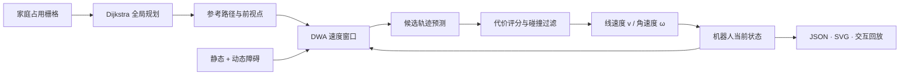

# Smart Home Transport Robot

> 2023 全国大学生机器人科技创新交流营暨机器人大赛团队项目 · 国家级三等奖  
> 以留存资料为依据完成的导航算法赛后重构，不是比赛原始源码。

[](https://github.com/QAQgpnu/smart-home-transport-robot/actions/workflows/demo-smoke.yml)
[](https://qaqgpnu.github.io/smart-home-transport-robot/)
[](LICENSE)


**[在线交互演示](https://qaqgpnu.github.io/smart-home-transport-robot/)** · **[English README](README_EN.md)** · **[证据边界](docs/PROJECT_EVIDENCE.md)** · **[模型说明](docs/MODEL.md)**

## 项目定位

这是一个面向求职作品集的、可运行的机器人导航重构。原比赛团队作品名为《智能家居搬运机器人》。留存资料中出现了 Dijkstra 全局路径规划与 DWA（Dynamic Window Approach）局部规划思路，但未找到可确认的比赛原始源码。

本仓库因此把可证明的技术方向重做成一个干净的小系统：在家庭栅格场景中先计算全局最短路径，再通过动态窗口速度采样应对运行中出现的障碍物，并输出可复核的数据、SVG 总览和浏览器动画。

> [已确认] 私有获奖证书记录该作品于 2023 年获得国家级三等奖，作品集所有者在证书团队名单中。证书含姓名、编号等个人信息，未上传。  
> [资料证据] 同期项目计划书创建于 2023 年，记录 Jetson Nano、ROS、Arduino、ESP8266、视觉识别、SLAM 和自主导航等技术设想。  
> [待确认] 现有资料没有逐成员职责表，仓库不声明个人在比赛阶段独立完成了哪些模块。  
> [已确认] 这里的全部代码与结果是 2026 年依据留存材料完成的赛后重构。

## 两分钟看懂

| 层级 | 实现 | 解决的问题 |
|---|---|---|
| 环境模型 | 24 × 16 占用栅格、家具障碍、起终点 | 把家庭场景变成可搜索空间 |
| 全局规划 | 8 邻域 Dijkstra、对角穿墙保护 | 生成无碰撞最短参考路径 |
| 局部规划 | 速度动态窗口、运动学前向预测 | 从当前可达速度中产生候选轨迹 |
| 轨迹评价 | 目标、路径、朝向、间距、速度五项代价 | 选择既安全又能推进任务的控制量 |
| 动态响应 | 第 36 步加入未知圆形障碍 | 展示局部绕行与重新贴近全局路线 |
| 可视化 | SVG 结果图 + Canvas 交互回放 | 让算法行为可以直接审查 |

默认场景的当前生成结果：

| 指标 | 结果 | 含义 |
|---|---:|---|
| 到达目标 | 是 | 最终位置进入 0.55 m 目标半径 |
| 控制步数 | 109 | 固定步长 0.2 s |
| 模拟路线长度 | 23.47 m | 对离散状态轨迹积分 |
| 最小障碍间距 | 0.45 m | 模拟轨迹到障碍外缘的最小距离 |
| 最终目标误差 | 0.488 m | 终点中心距离 |

这些是**确定性离线模拟结果**，不是实机定位精度、速度或安全认证数据。

## 一条命令生成演示

要求 Python 3.10+，核心实现只使用标准库：

```bash
python scripts/demo.py
```

命令会重新生成：

- `artifacts/navigation-run.json`：完整场景、全局路径、状态轨迹和指标；
- `figures/navigation-overview.svg`：适合 README 与简历展示的结果图；
- `docs/demo-data.js`：供离线网页和 GitHub Pages 回放的数据。

直接打开 `docs/index.html` 也可以在浏览器查看交互演示，无需启动服务器。

## 架构



核心代码分布：

- `model.py`：地图、机器人状态、场景与动态障碍；
- `planner.py`：Dijkstra、动态窗口、轨迹预测、代价函数与闭环模拟；
- `render.py`：从真实运行结果生成 JSON、JavaScript 数据和 SVG；
- `docs/`：无需构建工具的响应式交互页面。

## 与比赛材料的关系

```text
私有原始资料（只读）
├─ 获奖证书 ──────────────> 只用于核对奖项、年份、作品名和团队归属
├─ 2023 项目计划书 ───────> 只用于确认技术方向与团队名单
├─ 留存演示视频 ──────────> 只证明机器人完成过上肢动作演示
└─ 导航算法手写记录 ──────> 提供 Dijkstra + DWA 的重构线索

公开仓库（隔离副本）
└─ 重新实现的算法、场景、结果、文档与交互页面
```

没有上传证书、原计划书、原视频、团队成员姓名、比赛编号、二维码、第三方机器人 SDK 或无法确认授权的源码。详细证据分级见 [`docs/PROJECT_EVIDENCE.md`](docs/PROJECT_EVIDENCE.md)。

## 模型边界

- 使用二维圆形机器人和离散时间差速运动学，不模拟双足步态与重心控制；
- 静态障碍由栅格中心近似为圆形碰撞体；
- DWA 参数为演示场景确定性配置，不代表比赛实机参数；
- 动态障碍在预设控制步出现，不包含传感器噪声、SLAM 漂移或通信延迟；
- 没有复刻计划书中的视觉识别、语音交互、ROS 节点和智能家居控制功能；
- 原比赛源码缺失，无法声明代码级或性能级复现。

更多推导与代价函数见 [`docs/MODEL.md`](docs/MODEL.md)，决策记录见 [`docs/ARCHITECTURE.md`](docs/ARCHITECTURE.md)。

## 仓库结构

```text
smart-home-transport-robot/
├─ src/home_transport_robot/   # 重构后的规划、仿真与渲染代码
├─ scripts/demo.py              # 一条命令入口
├─ artifacts/                   # 可机器审查的运行结果
├─ figures/                     # README 结果图
├─ docs/                        # 交互页面与证据/模型文档
├─ .github/workflows/           # 演示冒烟检查与 Pages 发布
└─ pyproject.toml
```

## 许可证

本仓库中**重构代码与原创文档**采用 [MIT License](LICENSE)。未公开的比赛证书、团队计划书和演示媒体不属于本许可证范围。
