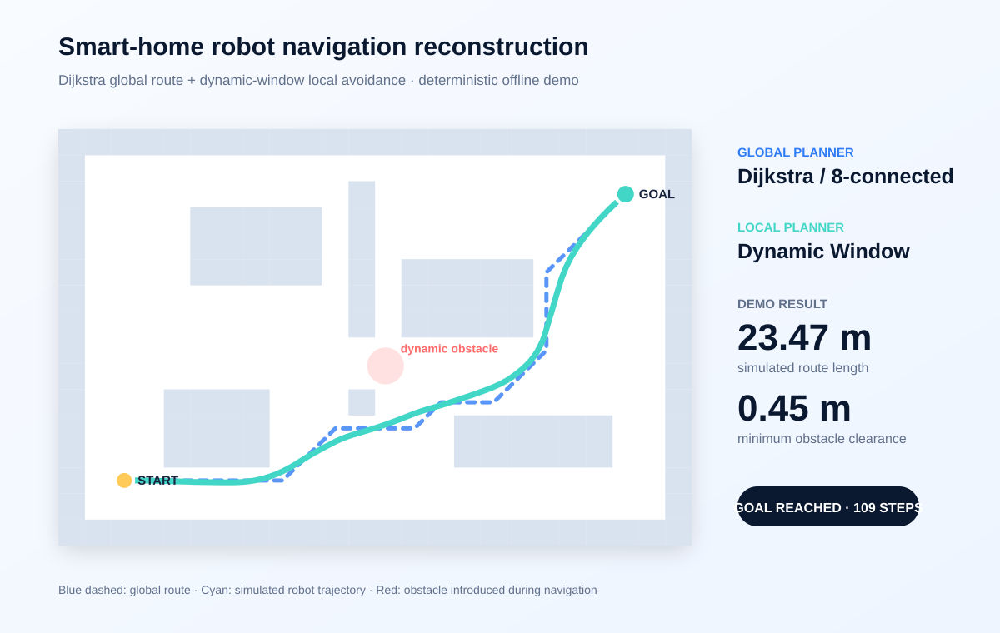

# Smart Home Transport Robot

> Team project from the 2023 National College Student Robot Science and Technology Innovation Exchange Camp and Robot Competition · National Third Prize  
> A post-competition navigation reconstruction based on retained materials, not the original competition code.

[Interactive demo](https://qaqgpnu.github.io/smart-home-transport-robot/) · [Evidence boundary](docs/PROJECT_EVIDENCE.md) · [Model notes](docs/MODEL.md)



## What this repository demonstrates

The original team entry was titled *Smart Home Transport Robot*. Retained planning material mentioned Dijkstra global planning and the Dynamic Window Approach (DWA), but no verifiable copy of the original competition source code remains.

This repository independently reconstructs that navigation direction as a compact, reviewable system:

- an 8-connected Dijkstra planner with diagonal corner-cut prevention;
- a velocity-window local planner with forward simulation and collision rejection;
- an explainable cost function balancing target progress, path adherence, heading, clearance, and speed;
- a deterministic dynamic-obstacle scenario;
- machine-readable results, a generated SVG, and a no-build interactive replay.

Run it with Python 3.10+:

```bash
python scripts/demo.py
```

The current default run reaches the goal in 109 control steps, travels 23.47 simulated metres, and keeps 0.45 m minimum obstacle-edge clearance. These are **offline simulation measurements**, not physical-robot performance claims.

## Evidence and attribution

- **Confirmed:** a privately reviewed certificate records a national third prize in 2023 for the named team project. It is not published because it contains personal identifiers.
- **Document evidence:** a 2023 project deck records the team and proposed Jetson Nano, ROS, Arduino, ESP8266, computer-vision, SLAM, and navigation direction.
- **Not confirmed:** the surviving material does not assign individual competition responsibilities.
- **Confirmed:** all code and generated results in this repository are a 2026 post-competition reconstruction.

The original certificate, deck, team names, video, competition identifiers, vendor SDKs, and code with unclear provenance are intentionally excluded. See [PROJECT_EVIDENCE.md](docs/PROJECT_EVIDENCE.md) for the full evidence matrix.

## Limitations

This is a 2D circular-robot simulation. It does not model biped gait control, sensor noise, SLAM drift, network latency, or the planned vision, speech, ROS, and smart-home modules. The original source is unavailable, so code-level and performance-level reproduction are not claimed.

Reconstructed code and original documentation in this repository are MIT licensed. Private competition materials are outside that license.
